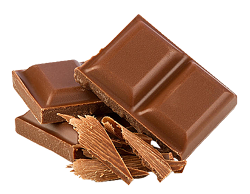

# 👩‍🏫 Адаптивний дизайн

- медіа-запити: media-type та media-feature  
- логічні оператори: and, not, or  
- метатег viewport  
- Chrome DevTools для роботи з мобільною версткою  
- адаптивна і респонсивна верстка  
- підхід mobile-first CSS  

---

## 1. Адаптивність (adaptive)  
**Адаптивна верстка** — створення кількох варіантів макетів під різні пристрої (десктоп, планшет, мобільний).  
**Респонсивна верстка** — один макет, який змінює структуру/стилі в залежності від ширини екрана.

---

## 2. DevTools  
Інструменти розробника у браузері Chrome дозволяють:
- перевіряти медіа-запити
- переглядати мобільну версію сторінки
- дебажити адаптивну верстку

---

## 3. Медіа-запити  

### Основні властивості:
- `min-width` — стилі застосовуються **від** вказаного розміру  
- `max-width` — стилі застосовуються **до** вказаного розміру  

### Приклад:
```css
@media screen and (max-width: 600px) {
  body {
    background-color: lightblue;
  }
}
```

### Перевизначення стилів / каскадування:
Стилі з media-запитів можуть перекривати базові стилі. Важливо дотримуватись порядку і специфічності.

---

## 4. Медіа-типи

- `screen`  
  Це найпоширеніший тип. Застосовується до дисплеїв: монітори, планшети, телефони тощо.  
  `@media screen and (max-width: 600px) {...}`

- `print`  
  Застосовується, коли сторінка друкується або переглядається в режимі попереднього перегляду друку.  
  `@media print {...}`

- `all`  
  Застосовується до всіх типів медіа (екрани, друк, голосові тощо).  
  `@media all and (min-width: 800px) {...}`

- `only`  
  Захисне ключове слово. Застосовує стилі тільки якщо браузер підтримує медіа-запит.  
  `@media only screen and (max-width: 600px) {...}`

- `not`  
  Заперечення: застосовує стилі до всього, крім вказаного типу медіа.  
  `@media not print {...}`

---

## 5. Логічні оператори (and, or, not)

- **and**  
  `@media screen and (min-width: 400px) and (max-width: 800px)`
  
- **or ( , )**  
  `@media screen and (max-width: 600px), (min-width: 900px)`
  
- **not**  
  `@media not print`

---

## 6. Mobile-first підхід

Підхід, при якому спочатку створюється дизайн для мобільних пристроїв, а потім поступово додається підтримка для більших екранів:

| Пристрій      | Розмір екрана |
|---------------|---------------|
| Мобільні      | 0 – 767px      |
| Планшети      | 768 – 1023px   |
| Десктопи      | 1024px і більше |

---

> ⚠️ 96dpi — стандартна щільність. Для Retina/HiDPI — 192dpi (2x).
> 1x img (96dpi), 2x (192pdi), 3x (288dpi)

## 7. Адаптивна графіка

Адаптивні зображення та фонові зображення, що змінюються залежно від роздільної здатності екрану.

---

## 8. Респонсивні зображення
```html


<picture>
    <source 
        media="(min-width: 1200px)" 
        srcset="../images/nazar.png 1x, ../images/how-its-made.jpg 2x"
    >
    <source 
        media="(min-width: 768px)" 
        srcset="../images/olena.png 1x, ../images/how-its-made.jpg 2x"
    >
    <source 
        media="(max-width: 767px)" 
        srcset="../images/viktoria.png 1x, ../images/how-its-made.jpg 2x"
    >
    
</picture>
```

---

## 9. Фонові зображення
```css
@media (min-resolution: 192dpi) {
  .box {
    background-image: url('photo@2x.png');
  }
}

@media screen and (min-width: 1200px) and (resolution: 192dpi) {
  .box {
    background-image: url('photo@2x.png');
  }
}

.box {
  background-image: image-set(
    url('photo.png') 1x,
    url('photo@2x.png') 2x
  );
  background-size: cover;
}
```
